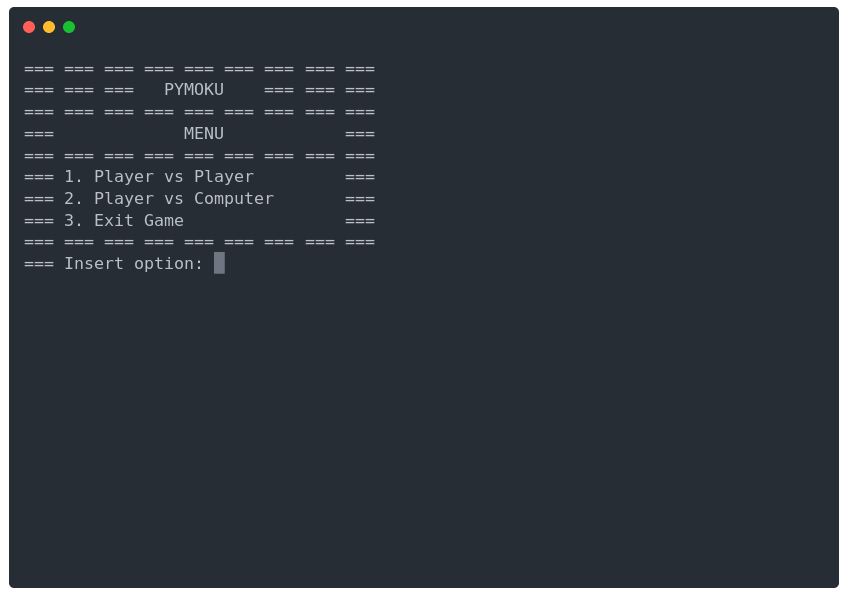
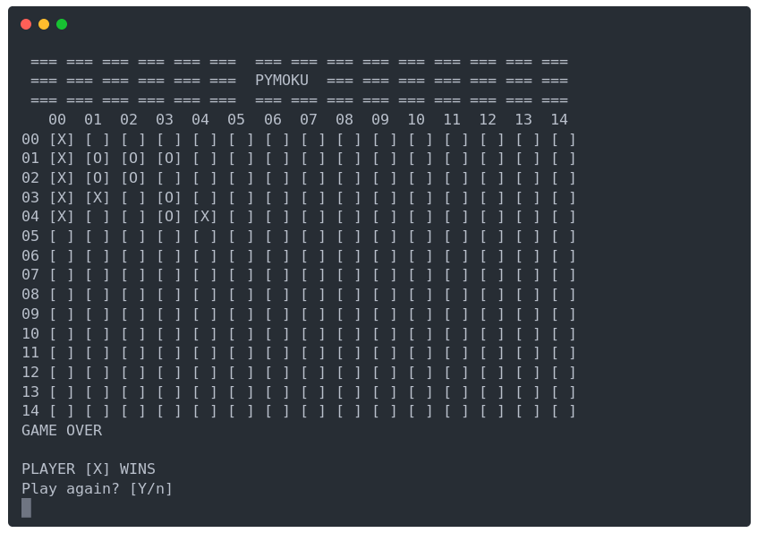

<h1 align="center">

</h1>

<p align="center">
Pymoku is a Gomoku game written in python.<br>
The AI was built using Minimax with Alpha-beta pruning
</p>

<p align="center">

</p>

<p align="center">

</p>

---

* [Demo](#demo)  
* [Installation](#installation)  
* [Gameplay](#gameplay)  
* [FAQ](#faq)  
* [Contributing](#contributing)  
* [License](#license) 

## Demo

<p align="center">

</p>

## Installation

### PyPI package

Pymoku is available on [PyPI](https://pypi.python.org/pypi/pymoku/) and can be installed with pip:

```bash
$ pip3 install pymoku
```

##Gameplay

## Contributing

All contributions are welcome!

## License
This project is distributed under the [MIT](LICENSE) license.
